# 📦 Live Order Monitoring System

A real-time order monitoring dashboard built with microservices architecture,
featuring live WebSocket updates for tracking orders instantly.

## 🏗️ Architecture Overview


## 🚀 Quick Start

### Prerequisites

- Docker & Docker Compose
- Node.js 20+ (for local development)
- Git

### 1. Clone Repository

```bash
git clone <repository-url>
cd Live-Order-Monitoring-System
```

### 2. Setup Environment Files

Copy `.env.example` files and configure:

```bash
# Copy environment files
cp gateway/.env.example gateway/.env
cp services/users-service/.env.example services/users-service/.env
cp services/orders-service/.env.example services/orders-service/.env
cp other-services/.env.example other-services/.env
cp frontend/.env.example frontend/.env
```

### 3. Start All Services

```bash
# Start all services with Docker Compose
docker-compose up -d

# Or for development with logs
docker-compose up
```

### 4. Initialize Database

The database will be automatically initialized with sample data from
`other-services/init.sql`.

### 5. Access Applications

| Service                | URL                       | Description                   |
| ---------------------- | ------------------------- | ----------------------------- |
| **Frontend Dashboard** | http://localhost:3003     | Main monitoring dashboard     |
| **API Gateway**        | http://localhost:3000     | REST API & WebSocket endpoint |
| **Users Service**      | http://localhost:3002/api | User management API           |
| **Orders Service**     | http://localhost:3001/api | Orders management API         |
| **Database**           | localhost:15432           | PostgreSQL (user: postgres)   |
| **Redis**              | localhost:6379            | Redis cache & pub/sub         |

## 🔐 Demo Accounts

| Role         | Email                | Password    | Permissions                                   |
| ------------ | -------------------- | ----------- | --------------------------------------------- |
| **Admin**    | admin@example.com    | password123 | View all orders, update status, manage system |
| **Staff**    | staff@example.com    | password123 | Monitor real-time orders                      |
| **Customer** | customer@example.com | password123 | Create new orders                             |

## 📡 Real-Time WebSocket Flow

### How Real-Time Updates Work:

```mermaid
sequenceDiagram
    participant C as Customer
    participant OS as Orders Service
    participant R as Redis
    participant GW as Gateway
    participant S as Staff Dashboard

    C->>OS: POST /api/orders (Create Order)
    OS->>OS: Save to PostgreSQL
    OS->>R: PUBLISH order_events {"event": "order_created", "data": {...}}
    R->>GW: Message: order_created
    GW->>S: WebSocket: "new_order" event
    S->>S: Update UI in real-time ✨

    Note over S: Staff sees new order instantly!

    S->>GW: PATCH /api/orders/{id}/status
    GW->>OS: Update order status
    OS->>R: PUBLISH order_events {"event": "order_status_updated", "data": {...}}
    R->>GW: Message: order_status_updated
    GW->>S: WebSocket: "order_status_update" event
    S->>S: Update order status in UI ✨
```



### WebSocket Events:

- **`new_order`**: When a customer creates a new order
- **`order_status_update`**: When order status changes (pending → confirmed →
  preparing → shipped → delivered)

## 🏛️ Service Responsibilities

### 🌐 **Frontend (Next.js)**

- **Dashboard UI**: Real-time order monitoring interface
- **Authentication**: Login/logout with JWT tokens
- **WebSocket Client**: Receives live updates from gateway
- **Order Management**: View orders, update status, filters
- **Responsive Design**: Works on desktop and mobile

**Key Files:**

- `src/app/(auth)/dashboard/` - Protected dashboard pages
- `src/hooks/useWebSocket.ts` - WebSocket connection management
- `src/contexts/AuthContext.tsx` - Authentication state management

### 🚪 **API Gateway (NestJS)**

- **Reverse Proxy**: Routes requests to appropriate microservices
- **Authentication Middleware**: Validates JWT tokens for protected routes
- **WebSocket Hub**: Central point for real-time communications
- **Redis Subscriber**: Listens to events and broadcasts to WebSocket clients
- **CORS & Security**: Handles cross-origin requests and security headers

**Key Features:**

- Proxy `/users/*` → Users Service
- Proxy `/orders/*` → Orders Service
- WebSocket endpoint for real-time updates
- JWT verification for protected routes

### 👤 **Users Service (NestJS)**

- **Authentication**: Login/register with bcrypt password hashing
- **JWT Management**: Token generation and validation
- **User Profiles**: CRUD operations for user data
- **Role-Based Access**: Admin, Staff, Customer roles
- **Database**: PostgreSQL with TypeORM

**API Endpoints:**

- `POST /api/auth/login` - User login
- `POST /api/auth/register` - User registration
- `GET /api/auth/verify` - Token verification
- `GET /api/users/profile` - Get user profile

### 📦 **Orders Service (NestJS)**

- **Order Management**: CRUD operations for orders
- **Product Catalog**: Manage products and inventory
- **Business Logic**: Order validation, stock management
- **Event Publishing**: Redis pub/sub for real-time updates
- **Database**: PostgreSQL with relations (orders → order_items → products)

**API Endpoints:**

- `GET /api/orders` - List all orders
- `POST /api/orders` - Create new order
- `PATCH /api/orders/{id}/status` - Update order status
- `GET /api/products` - List products

## 🗄️ Database Schema

```sql
-- Users table
users (id, email, password, name, role, created_at)

-- Products table
products (id, name, description, price, stock, created_at, updated_at)

-- Orders table
orders (id, customer_id, total_amount, status, created_at, updated_at)

-- Order Items table (junction table)
order_items (id, order_id, product_id, quantity, price, created_at, updated_at)
```

## 🔧 Development

### Run Services Individually

```bash
# Users Service
cd services/users-service
npm install
npm run dev

# Orders Service
cd services/orders-service
npm install
npm run dev

# Gateway
cd gateway
npm install
npm run dev

# Frontend
cd frontend
npm install
npm run dev
```

### Build for Production

```bash
# Build all services
docker-compose -f docker-compose.prod.yml up --build

# Or build individual services
cd services/users-service && npm run build
cd services/orders-service && npm run build
cd gateway && npm run build
cd frontend && npm run build
```

## 📚 API Documentation

### Postman Collection

Import the Postman collection for testing APIs:

- **File**: `docs/Live-Order-Monitoring.postman_collection.json`
- **Environment**: `docs/Local-Development.postman_environment.json`

### Testing Order Creation Flow:

1. **Login**: `POST /users/api/auth/login`
2. **Create Order**: `POST /orders/api/orders`
3. **Monitor**: Watch real-time updates in dashboard
4. **Update Status**: `PATCH /orders/api/orders/{id}/status`

## 🧪 Testing WebSocket

Open multiple browser tabs to simulate multiple staff members:

1. **Tab 1**: Login as Admin → Dashboard
2. **Tab 2**: Login as Staff → Dashboard
3. **Create Order**: Use Postman or another browser
4. **Watch**: Both dashboards update instantly! ✨

## 🔍 Troubleshooting

### Common Issues:

**WebSocket not connecting:**

```bash
# Check if Gateway is running
curl http://localhost:3000

# Check Redis connection
docker-compose logs redis
```

**Database connection error:**

```bash
# Check PostgreSQL logs
docker-compose logs postgres

# Verify database is initialized
docker-compose exec postgres psql -U postgres -d live_orders -c "\dt"
```

**Services not starting:**

```bash
# View all logs
docker-compose logs

# Restart specific service
docker-compose restart gateway
```

## 📦 Docker Services

| Container        | Port  | Health Check     |
| ---------------- | ----- | ---------------- |
| `postgres_db`    | 15432 | `pg_isready`     |
| `redis_cache`    | 6379  | `redis-cli ping` |
| `users_service`  | 3002  | `curl /api`      |
| `orders_service` | 3001  | `curl /api`      |
| `api_gateway`    | 3000  | `curl /`         |
| `frontend_app`   | 3003  | `curl /`         |

## 🚀 Deployment

### Local Production

```bash
# Production build
docker-compose -f docker-compose.prod.yml up -d

# Scale services
docker-compose up -d --scale orders-service=3
```

### Environment Variables

Essential configuration in `.env` files:

- `DATABASE_URL` - PostgreSQL connection
- `REDIS_HOST` - Redis server location
- `JWT_SECRET` - Secret for token signing
- `NODE_ENV` - Environment (development/production)

## 📄 License

MIT License - see LICENSE file for details.

---

## 🎯 Features Showcase

✅ **Real-time Updates** - WebSocket streaming  
✅ **Microservices** - Modular architecture  
✅ **Authentication** - JWT + Role-based access  
✅ **Database Relations** - Normalized PostgreSQL schema  
✅ **Event-Driven** - Redis pub/sub communication  
✅ **Docker Compose** - Complete containerization  
✅ **Type Safety** - Full TypeScript implementation  
✅ **Responsive UI** - Works on all devices

**Built with ❤️ for real-time order monitoring**
